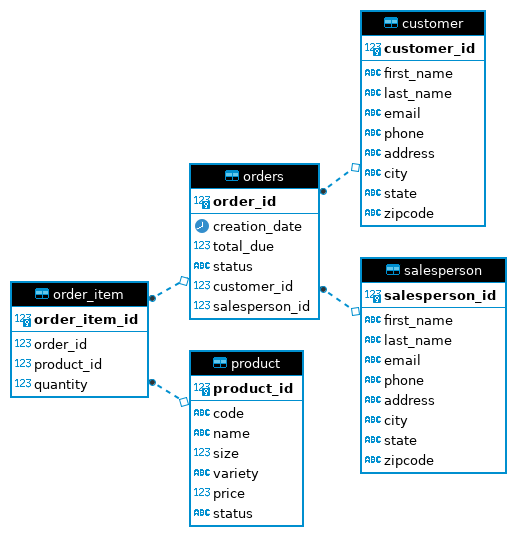

# Introduction
(50-100 words)
The JDBC project is an application that uses the Data Access Object pattern with the JDBC API to access and run queries against an RDBMS database.
These queries are used to create, retrieve, and delete records from the database.
The technologies used in this project are core Java, JDBC, PostgreSQL containerized with Docker, PSQL CLI, and Maven to build and manage the project.

# Implementation
## ER Diagram
The diagram above shows the relationships between the entities used in the project.

## Design Patterns
There are two approaches or design patterns to implementing database access in Java using the JDBC - the data access object and the repository pattern. 
This project leverages the use of the DAO pattern to interact with the underlying database.
They are both used to abstract the interaction with the persistence layer or database - one with a higher level of abstraction than the other.

The Data Access Object DAO Pattern
The DAO pattern is a table-centric abstraction of the database that uses an abstract API to hide all the complexity of performing CRUD operations in the database.
It is closest to the database.
In a DAO pattern, the abstract API is usually an interface of a generic type T that defines the different CRUD operations for a given table T.
Then you have classes that implement those interfaces for each table using queries to perform the CRUD operations.
The main code then uses those classes rather than writing the queries in the application code.

Repository Pattern
The repository pattern encapsulates search, retrieval and storage in persistence layer using repositories. 
This repository emulates a collection of objects.
It is an abstraction of a collection of objects existing between domain and the data mapping / access layers that hides the complexity of collating data and preparing a domain bject. 
A repository can use a DAO to access the database. 
In the repository pattern, when doing joins, you perform the joins in the code using DAOs as opposed to relying on the capabilities of the persistence layer.

# Test
Docker was used to set up the PostgreSQL instance used. To create the database, the DDL script in `/sql` was run against the PostgreSQL instance using the psql client.
Test data was loaded into the database using the respective scripts in the `/sql` folder.
The `jDBCExecutor` file is the entry to the app. After executing the code in the main function, queries were run against the database using DBeaver's SQL script editor to confirm that the code works as expected.