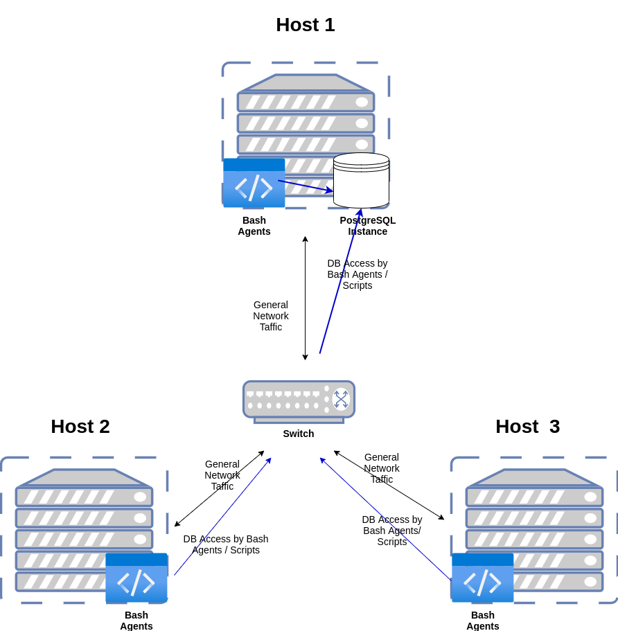

# Linux Cluster Monitoring Agent
# Introduction
The Linux Cluster Monitoring Agent is a tool for managing and monitoring hardware information and resource usage for nodes in a Linux cluster.
It collects and stores information on the hardware specifications for each node in the Linux cluster.
It also tracks the usage of resources like memory and CPU for each node at one-minute intervals.
It uses bash scripts to automate the extraction and storage of all this information to a PostgreSQL database provisioned with Docker.
Additionally, data stored in the database can be queried to group hosts by CPU specification, view average resource usage over time, and spot server failures.

Linux Cluster administrators who need to manage multiple Linux nodes in a cluster can use the Linux Cluster Monitoring Agent.
It will provide them with the ability to access hardware specifications real-time data on resource usage of each of the nodes in the cluster to aid future planning,
The technologies used are Docker, PostgreSQL, and Bash Scripting.

# Quick Start
- Start a psql instance using psql_docker.sh
  ```
  $ ./scripts/psql_docker.sh start|stop|create [psql_username][psql_password]
  ```
- Create tables using ddl.sql
  ```
  $ psql -h <psql_host> -U <psql_username> -d <db_name> -f sql/ddl.sql
  ```
- Insert hardware specs data into the DB using host_info.sh
  ```
  $ ./scripts/host_info.sh psql_host psql_port db_name psql_user psql_password
  ```
- Insert hardware usage data into the DB using host_usage.sh
  ```
  $ ./scripts/host_usage.sh psql_host psql_port db_name psql_user psql_password
  ```
- Crontab setup
  - Open the crontab file for editing using the command below:
    ```
    $ crontab -e
    ```
  - Add the following line to the crontab file
    ```
    * * * * * bash ./scripts/host_usage.sh <psql_host> <psql_port> <db_name> <psql_username> <psql_password> &> /tmp/host_usage.log
    ```

# Implementation
There are three key components to this project. First, Docker is used to provision a PostgreSQL instance for the admin node.
This PostgreSQL instance is used to create a database to store the hardware specification and usage information for each node in the cluster
The `psql_docker.sh` script written is used to run commands to create and manage the PostgreSQL instance. The three commands are `create` `start` and `stop`. 
The `create` command requires two arguments - the PostgreSQL username and password. With these two details, the `psql_docker.sh` script creates a PostgreSQL instance.
The `start` and `stop` commands are used to start and stop the docker instance respectively. Using the PostgreSQL client, a database `host_agent` is created. 
To create the tables `host_info` and `host_usage` for storing the hardware specification and resource usage respectively, the file `ddl.sql` is run against the database using the psql client.

The next component is the bash agent. To retrieve the information to be stored in the tables created, there are two bash scripts created, namely, `host_info.sh` and `host_usage.sh`. 
These two scripts automate the process of extracting hardware information and resource usage data using bash commands and inserting them into the database.

Finally, there is the `queries.sql` component. This SQL script contains SQL queries that answers relevant business questions such as the average amount  of resources used and how many dead nodes there are to help the team with resource planning.

## Architecture


## Scripts
- psql_docker.sh
  This script is for creating, stating or stopping a PostgreSQL Docker container.
  
  To create a new container:
  ```
  ./scripts/psql_docker.sh create <psql_username> <psql_password>
  ```
  To start the container
  ```
  ./scripts/psql_docker.sh start
  ```
  To stop the container
  ```
  ./scripts/psql_docker.sh stop
  ```
- host_info.sh
  
  This script is for extracting hardware specification information from the nodes and inserting the `host_info` table with this information.
  ```
  ./scripts/host_info.sh <psql_host> <psql_port> <db_name> <psql_username> <psql_password>
  ```
- host_usage.sh

  This script is for extracting resource usage information from the nodes and inserting the `host_usage` table with this information.
  ```
  ./scripts/host_usage.sh <psql_host> <psql_port> <db_name> <psql_username> <psql_password>
  ```
- crontab

  This is a file that is responsible for automatically running the `host_usage.sh` script at 1-minute intervals to collect real time resource usage information.
  - Edit crontab jobs
    ```
    $ crontab -e
    ```
  - Add job that triggers `host_usage.sh` every minute
    ```
    * * * * * bash scripts/host_usage.sh <psql_host> <psql_port> <db_name> <psql_username> <psql_password> &> /tmp/host_usage.log
    ```
  - Check the number of crontab jobs
    ```
    $ crontab -l
    ```
  - Verify that the job ran successfully
    ```
    $ cat tmp/host_usage.log
    ```
- queries.sql
  
  This SQL script contains queries to analyze the nodes, their specifications and their resource usage.
  - In the first query, nodes are grouped by the number of cpu they have and order them by the total memory of each node. This provides a quick lance at which nodes have the highest memory.
  - The next query retrieves the average percentage of memory used for every 5 minute interval.
  - The last query helps to identify dead nodes by information about the nodes that fail to record CPU usage at least 3 times in 5 minutes. This help the administrators to monitor the health of the cluster.

## Database Modeling
- `host_info`

  | Column | Type | Description
  | ------ | ---- | -------
  | id | SERIAL | Primary key identifying each host
  | host_name | VARCHAR | The fully qualified name for the host
  | cpu_number | INTEGER | The number of CPUs each host has
  | cpu_architecture | VARCHAR | The architecture of the CPU
  | cpu_model | VARCHAR | The CPU model name
  | cpu_mhz | NUMERIC | The CPU speed for the host
  | ls_cache | INTEGER | The size of the L2 cache in kilobytes
  | total_mem | INTEGER | The total memory of the host in Kilobytes
  | timestamp | TIMESTAMP | UTC time at which the information is stored

- `host_usage`

  | Column | Type | Description
  | ------ | ---- | -----------
  | timestamp | TIMESTAMP | UTC Date and Time for each record insertion
  | host_id | INTEGER | Foreign Key The id of the host for each resource usage stored
  | memory_free | NUMERIC | Amount of free memory in Megabytes MB
  | cpu_idle | NUMERIC | Percentage of CPU time spent idle
  | cpu_kernel | NUMERIC | Percentage of CPU time spent running kernel code
  | disk_io | INTEGER | Number of disk input and output
  | disk_available | INTEGER | Amount of disk storage available in the root directory MB

# Test
The bash scripts were tested on the command line with different number of arguments to ensure that the correct exit status and error messages are displayed to the user.
For the `psql_dcker.sh` script, appropriate error messages are displayed when the username or password for creating the psql instance is missing. The container is created if all arguments are correct.
The `host_usage.sh` script was run on the command line to test it and see that it populates the table before automating it using crontab.
The database was populated with test data ad subsequently real data to verify the SQL queries.
To verify that the crontab works as expected, on the command line, I verified that the `host_usage.log` file exists and it contains the output of running the `host_usage.sh` script.
All scripts work as expected and the SQL queries produce expected results.

# Deployment
All bash and SQL script source code are managed with Git and GitHub. The PostgreSQL database is provisioned using Docker.
Crontab is used to schedule the agent program to run at one-minute intervals

# Improvements
- Abstract the container creation code into a function and 
  call that function to create the container if it does not exist
  when the start|stop commands are called instead of just logging a message to the
  terminal and producing an exit status of 1.
- Include the creation of the database when creating the PostgreSQL instance to eliminate the need to manually create it on the command-line
- Update the `host_info.sh` script to check for any hardware specification changes on each host and automate it to run periodically. 
